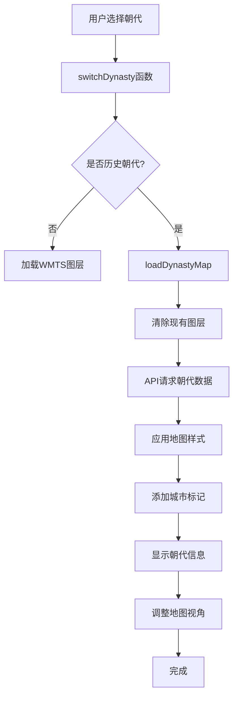
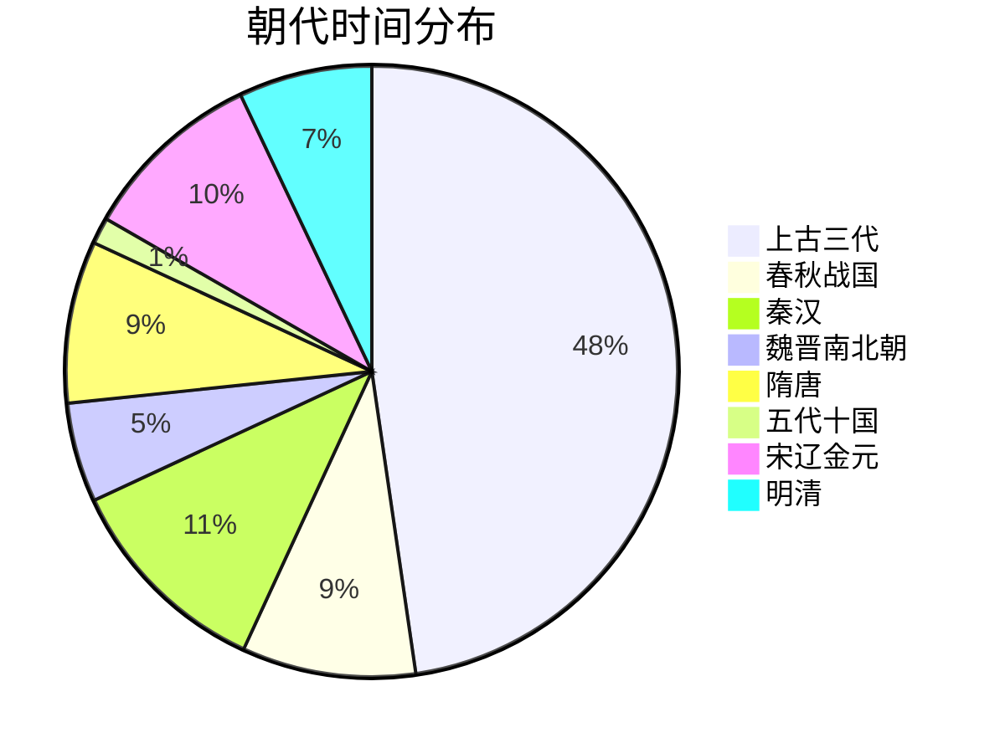

# 中国历史朝代系统深度分析报告

## 📋 系统概述

中国历史朝代系统是Mr诸葛军事教育AI助手的核心功能之一，实现了从夏朝到清朝的完整时空融合系统，支持一键切换朝代地图，智能显示历史城市。这是中国历史上第一个完整实现时空融合的军事教育AI系统。

---

## 🏗️ 系统架构

### 架构图

```mermaid
graph TB
    subgraph 前端层
        A[朝代选择器<br/>dynasty-select] --> B[switchDynasty函数]
        B --> C{是否历史朝代?}
        C -->|是| D[loadDynastyMap]
        C -->|否| E[addWMTSLayer]
        D --> F[API请求<br/>/api/v1/dynasty/dynasty/{id}]
        F --> G[dynasty_api.py]
        G --> H[dynasties.json]
        H --> I[返回朝代数据]
        I --> J[applyHistoricalMapStyle]
        I --> K[addHistoricalCities]
        I --> L[addDynastyInfo]
        J --> M[地图滤镜效果]
        K --> N[城市标记系统]
        L --> O[朝代信息面板]
    end

    subgraph 后端API层
        G --> G1[get_dynasty_data]
        G --> G2[get_all_dynasties]
        G --> G3[get_dynasty_cities]
        G --> G4[search_historical_city]
        G --> G5[get_historical_events]
        G --> G6[get_dynasty_categories]
        G --> G7[quick_search]
        G --> G8[health_check]
    end

    subgraph 数据层
        H --> H1[18个朝代数据]
        H --> H2[60个历史城市]
        H --> H3[54个历史事件]
        H --> H4[城市类型配置]
        H --> H5[地图样式配置]
    end
```

---

## 📊 数据架构

### 1. 朝代数据结构 (dynasties.json)

每个朝代包含以下字段：

```json
{
  "id": "xia_2070",              // 朝代唯一标识
  "name": "夏朝",                // 朝代名称
  "period": "前2070-前1600",     // 历史时期
  "startYear": -2070,            // 起始年份（负数表示公元前）
  "endYear": -1600,              // 结束年份
  "capital": {                   // 都城信息
    "name": "阳城",
    "position": [113.62, 34.75], // [经度, 纬度]
    "modernName": "河南登封"
  },
  "majorCities": [               // 重要城市列表
    {
      "name": "阳城",
      "position": [113.62, 34.75],
      "modernName": "河南登封",
      "type": "capital",          // 城市类型
      "importance": "major"       // 重要性级别
    }
  ],
  "historicalEvents": [           // 历史事件
    {
      "year": -2070,
      "event": "大禹建立夏朝",
      "location": [113.62, 34.75],
      "description": "禹建立夏朝，定都阳城，标志中国第一个朝代的开始"
    }
  ],
  "mapStyle": {                  // 地图样式配置
    "filter": "sepia(0.8) saturate(1.3) hue-rotate(35deg)",
    "overlayColor": "rgba(218, 165, 32, 0.2)"
  },
  "color": "#DAA520",            // 朝代主题色
  "flag": "🏺"                  // 朝代图标
}
```

### 2. 城市类型系统

| 城市类型 | 图标 | 颜色 | 说明 |
|---------|------|------|------|
| capital | 👑 | #FFD700 | 首都 |
| secondary | 🏛️ | #FF6347 | 陪都 |
| metropolis | 🏙️ | #4169E1 | 大都会 |
| prefecture | 🏯 | #32CD32 | 州府 |
| fortress | 🛡️ | #FF4500 | 要塞 |
| port | ⚓ | #00CED1 | 港口 |
| palace | 🏰 | #9370DB | 宫殿 |
| summer_palace | 🌸 | #FFB6C1 | 行宫 |
| battlefield | ⚔️ | #FF0000 | 战役地点 |

### 3. 朝代分类

| 分类 | 朝代ID | 时期 |
|------|---------|------|
| 上古三代 | xia_2070, shang_1600, zhou_1046 | 前2070-前256 |
| 春秋战国 | spring_autumn_770, warring_475 | 前770-前221 |
| 秦汉 | qin_221, han_202 | 前221-220 |
| 魏晋南北朝 | three_kingdoms_220, jin_265 | 220-420 |
| 隋唐 | sui_581, tang_618 | 581-907 |
| 五代十国 | five_dynasties_907 | 907-960 |
| 宋辽金元 | song_960, liao_907, western_xia_1038, song_1127, jin_1115, yuan_1271 | 907-1368 |
| 明清 | ming_1368, qing_1644 | 1368-1912 |

---

## 🔌 后端API实现

### API接口列表

| 接口 | 方法 | 功能 | 状态 |
|------|------|------|------|
| `/api/v1/dynasty/health` | GET | 健康检查 | ✅ |
| `/api/v1/dynasty/dynasties` | GET | 获取所有朝代 | ✅ |
| `/api/v1/dynasty/dynasty/{id}` | GET | 获取指定朝代详情 | ✅ |
| `/api/v1/dynasty/cities/{id}` | GET | 获取朝代城市 | ✅ |
| `/api/v1/dynasty/search-city/{name}` | GET | 搜索历史城市 | ✅ |
| `/api/v1/dynasty/historical-events/{id}` | GET | 获取历史事件 | ✅ |
| `/api/v1/dynasty/categories` | GET | 获取朝代分类 | ✅ |
| `/api/v1/dynasty/quick-search` | GET | 快速搜索 | ✅ |

### 核心API实现分析

#### 1. 获取朝代详情 (`get_dynasty_data`)

```python
@router.get("/dynasty/{dynasty_id}")
async def get_dynasty_data(dynasty_id: str):
    """获取指定朝代的详细信息"""
    try:
        # 检查文件是否存在
        if not os.path.exists(DYNASTIES_FILE):
            raise HTTPException(status_code=500, detail="朝代数据文件不存在")
        
        # 读取朝代数据
        with open(DYNASTIES_FILE, "r", encoding="utf-8") as f:
            data = json.load(f)
        
        # 查找指定朝代
        dynasty = next((d for d in data["dynasties"] if d["id"] == dynasty_id), None)
        
        if not dynasty:
            raise HTTPException(status_code=404, detail=f"朝代 '{dynasty_id}' 未找到")
        
        return dynasty
    except Exception as e:
        logger.error(f"获取朝代数据时发生错误: {str(e)}")
        raise HTTPException(status_code=500, detail=f"服务器内部错误: {str(e)}")
```

**特点**：
- 完善的错误处理机制
- 支持中文文件名和内容
- 详细的日志记录

#### 2. 搜索历史城市 (`search_historical_city`)

```python
@router.get("/search-city/{city_name}")
async def search_historical_city(city_name: str):
    """搜索历史城市"""
    # 模糊匹配逻辑
    is_match = (
        search_term.lower() in city["name"].lower() or
        city["name"].lower() in search_term.lower() or
        search_term.lower() in city.get("modernName", "").lower() or
        city.get("modernName", "").lower() in search_term.lower()
    )
```

**特点**：
- 支持历史地名和现代地名双向搜索
- 模糊匹配算法
- 自动去重

---

## 🎨 前端交互实现

### 1. 朝代选择器

```html
<select id="dynasty-select" onchange="switchDynasty(this.value)">
    <option value="none">-- 现代地图 --</option>
    <optgroup label="上古三代">
        <option value="xia_2070">夏朝 (前2070-前1600)</option>
        <option value="shang_1600">商朝 (前1600-前1046)</option>
        <option value="zhou_1046">周朝 (前1046-前256)</option>
    </optgroup>
    <!-- 其他分组... -->
</select>
```

**特点**：
- 分组显示，便于查找
- 显示朝代时期
- 支持自定义WMTS图层

### 2. 朝代地图加载流程

```javascript
async function loadDynastyMap(dynastyId) {
    try {
        dynastyLoading = true;
        showDynastyLoading(true);
        
        // 1. 清除现有历史图层
        clearHistoricalLayers();
        
        // 2. 加载朝代数据
        const response = await fetch(`/api/v1/dynasty/dynasty/${dynastyId}`);
        const dynastyData = await response.json();
        currentDynasty = dynastyData;
        
        // 3. 设置历史地图样式
        applyHistoricalMapStyle(dynastyData.mapStyle);
        
        // 4. 添加朝代信息面板
        addDynastyInfo(dynastyData);
        
        // 5. 添加历史城市标记
        await addHistoricalCities(dynastyData.majorCities);
        
        // 6. 调整地图视角
        if (dynastyData.capital && dynastyData.capital.position) {
            map.setCenter(dynastyData.capital.position);
            map.setZoom(6);
        }
        
    } catch (error) {
        console.error('加载朝代地图失败:', error);
        showDynastyError(error.message);
    } finally {
        dynastyLoading = false;
        showDynastyLoading(false);
    }
}
```

**流程图**：



### 3. 城市标记系统

```javascript
function createHistoricalCityMarker(city) {
    const markerConfig = getCityMarkerConfig(city);
    
    const marker = new AMap.Marker({
        position: city.position,
        content: createCityMarkerContent(city, markerConfig),
        offset: new AMap.Pixel(-15, -30),
        title: `${city.name} (${city.modernName}) - ${city.type}`,
        zIndex: 100 + getCityImportanceScore(city.importance)
    });
    
    // 添加点击事件
    marker.on('click', () => {
        showCityInfo(city);
    });
    
    return marker;
}
```

**城市标记内容结构**：

```html
<div class="dynasty-city-marker">
    <div class="city-icon">
        👑  <!-- 图标根据城市类型变化 -->
    </div>
    <div class="city-label">
        <div>阳城</div>
        <div>河南登封</div>
    </div>
</div>
```

### 4. 地图样式系统

```javascript
function applyHistoricalMapStyle(styleConfig) {
    const mapElement = document.getElementById('map');
    
    // 应用历史滤镜
    if (styleConfig && styleConfig.filter) {
        mapElement.style.filter = styleConfig.filter;
    } else {
        mapElement.style.filter = 'sepia(0.5) contrast(1.1)';
    }
    
    // 添加历史地图遮罩层
    addHistoricalOverlay(styleConfig);
}
```

**滤镜效果示例**：

| 朝代 | 滤镜效果 | 遮罩颜色 |
|------|---------|---------|
| 夏朝 | sepia(0.8) saturate(1.3) hue-rotate(35deg) | rgba(218, 165, 32, 0.2) |
| 商朝 | sepia(0.7) saturate(1.2) hue-rotate(30deg) | rgba(255, 69, 0, 0.2) |
| 周朝 | sepia(0.6) saturate(1.1) hue-rotate(25deg) | rgba(0, 191, 255, 0.2) |
| 秦朝 | sepia(0.5) saturate(1.0) hue-rotate(20deg) | rgba(128, 0, 128, 0.2) |
| 汉朝 | sepia(0.4) saturate(0.9) hue-rotate(15deg) | rgba(255, 215, 0, 0.2) |

---

## 📈 数据统计

### 朝代数据统计

| 分类 | 数量 | 说明 |
|------|------|------|
| 总朝代数 | 18个 | 从夏朝到清朝 |
| 历史城市 | 60个 | 包含首都、陪都、要塞等 |
| 战役地点 | 10个 | 野狐岭之战相关地点 |
| 历史事件 | 54个 | 每个朝代3个重要事件 |
| 城市类型 | 9种 | 从首都到战役地点 |
| 时间跨度 | 4000年 | 从前2070年到1912年 |

### 朝代分布



---

## 🎯 核心功能详解

### 1. 一键切换朝代

**实现原理**：
1. 用户从下拉菜单选择朝代
2. 前端调用`switchDynasty()`函数
3. 判断是否为历史朝代
4. 如果是历史朝代，调用`loadDynastyMap()`
5. 从API获取朝代数据
6. 清除现有图层
7. 应用新的地图样式
8. 添加城市标记
9. 显示朝代信息面板
10. 调整地图视角到朝代都城

**用户体验**：
- 即时响应，无需刷新页面
- 平滑的过渡动画
- 清晰的视觉反馈

### 2. 智能城市标注

**功能特点**：
- 不同城市类型使用不同图标和颜色
- 显示历史名称和现代对照
- 点击城市显示详细信息
- 根据重要性调整z-index

**城市信息窗口内容**：
- 历史名称
- 现代名称
- 城市类型
- 所属朝代
- 地理坐标

### 3. 历史搜索

**搜索范围**：
- 历史城市名称
- 现代城市名称
- 模糊匹配
- 跨朝代搜索

**搜索结果**：
- 城市名称
- 现代名称
- 所属朝代
- 朝代时期
- 地理坐标
- 城市类型
- 重要性级别

### 4. 视觉沉浸效果

**地图滤镜**：
- 使用CSS filter属性
- 不同朝代不同滤镜
- 营造历史氛围

**遮罩层**：
- 半透明颜色遮罩
- 增强历史感
- 不影响交互

---

## 🔧 技术实现亮点

### 1. 数据驱动架构

**优势**：
- 易于维护和扩展
- 数据与逻辑分离
- 支持批量操作

**扩展性**：
- 添加新朝代只需修改JSON文件
- 无需修改代码
- 前端自动更新

### 2. 模块化设计

**前后端分离**：
- 后端提供RESTful API
- 前端独立渲染
- 松耦合架构

**组件化**：
- 城市标记组件
- 信息面板组件
- 地图样式组件

### 3. 错误处理机制

**后端**：
- 完善的异常捕获
- 详细的错误信息
- 日志记录

**前端**：
- 加载状态显示
- 错误提示
- 降级处理

### 4. 性能优化

**缓存机制**：
- 朝代数据缓存
- 减少API请求
- 提升响应速度

**懒加载**：
- 按需加载城市标记
- 避免一次性渲染过多元素
- 优化地图性能

---

## 📋 已知问题和限制

### 1. 数据完整性

**问题**：
- 部分朝代数据不够详细
- 历史事件数量有限
- 城市数据可能不准确

**解决方案**：
- 持续补充历史数据
- 引入专业历史学者审核
- 建立数据验证机制

### 2. 地图精度

**问题**：
- 历史地图使用现代地图底图
- 历史疆域边界不准确
- 城市位置可能存在误差

**解决方案**：
- 集成历史地图WMTS服务
- 使用历史地理数据
- 提供位置校准功能

### 3. 性能问题

**问题**：
- 大量城市标记可能影响性能
- 地图滤镜可能导致卡顿
- 移动端体验不佳

**解决方案**：
- 实现标记聚合
- 优化滤镜算法
- 开发移动端适配版本

---

## 🚀 后续优化方向

### 短期优化

1. **数据扩展**
   - 添加春秋战国时期数据
   - 补充更多历史城市
   - 增加历史事件详情

2. **功能增强**
   - 实现历史事件时间轴播放
   - 添加朝代对比功能
   - 支持战役地点标注

3. **用户体验**
   - 添加朝代切换动画
   - 优化加载速度
   - 改进错误提示

### 长期扩展

1. **AI增强**
   - 集成AI历史问答
   - 智能推荐相关朝代
   - 自动生成历史解说

2. **社交功能**
   - 用户收藏朝代
   - 分享历史地图
   - 社区讨论功能

3. **教育功能**
   - 添加学习进度跟踪
   - 实现测验功能
   - 开发课程体系

---

## 📚 参考文档

- [dynasties.json](../knowledge_base/dynasties.json) - 朝代数据文件
- [city_mappings.json](../knowledge_base/city_mappings.json) - 城市映射文件
- [dynasty_api.py](../src/api/dynasty_api.py) - 朝代API实现
- [index.html](../static/index.html) - 前端实现（第2039-2423行）

---

**报告生成时间**: 2025-12-28  
**系统版本**: 2.1  
**数据版本**: 18朝代60城市
