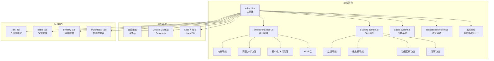
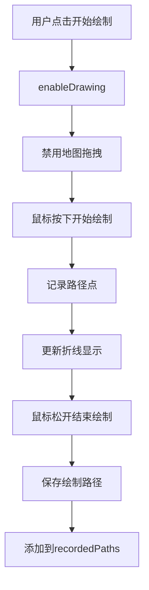

# 前端交互系统深度分析报告

## 📋 系统概述

前端交互系统是Mr诸葛军事教育AI助手用户界面的核心，负责提供沉浸式的军事指挥中心体验。系统采用原生JavaScript + CSS3实现，集成高德地图和Cesium.js 3D地球，支持窗口管理、战术绘图、战役推演等多种交互功能。

---

## 🏗️ 系统架构

### 架构图



---

## 🎨 核心组件分析

### 1. 窗口管理系统 (WindowManager)

**文件**: [`static/js/window-manager.js`](../static/js/window-manager.js)

#### 功能概述
WindowManager类负责管理所有UI面板窗口，提供拖拽、调整大小、最小化、关闭、恢复等功能。

#### 核心功能

| 功能 | 方法 | 说明 |
|------|------|------|
| 注册窗口 | `register(elementId, title, icon)` | 将DOM元素注册为可管理窗口 |
| 最小化 | `minimize(id)` | 隐藏窗口并添加到Dock栏 |
| 关闭 | `close(id)` | 关闭窗口，停止视频播放 |
| 恢复 | `restore(id)` | 从Dock栏恢复窗口显示 |
| 置顶 | `bringToFront(element)` | 将窗口带到最上层 |

#### 拖拽实现

```javascript
makeDraggable(element) {
    let pos1 = 0, pos2 = 0, pos3 = 0, pos4 = 0;
    let isDragging = false;
    
    // 查找或创建拖拽手柄区域
    let dragHandle = element.querySelector('.panel-header, .toolbar-title');
    
    dragHandle.onmousedown = dragMouseDown;
    
    function dragMouseDown(e) {
        // 防止点击窗口控件时拖拽
        if (e.target.classList.contains('win-btn')) return;
        if (e.target.tagName === 'BUTTON' || e.target.tagName === 'INPUT') return;
        
        e.preventDefault();
        e.stopPropagation();
        
        isDragging = true;
        pos3 = e.clientX;
        pos4 = e.clientY;
        
        element.style.opacity = '0.9';
        element.style.cursor = 'move';
        
        document.onmouseup = closeDragElement;
        document.onmousemove = elementDrag;
    }
    
    function elementDrag(e) {
        if (!isDragging) return;
        
        e.preventDefault();
        
        pos1 = pos3 - e.clientX;
        pos2 = pos4 - e.clientY;
        pos3 = e.clientX;
        pos4 = e.clientY;
        
        // 计算新位置
        let newTop = element.offsetTop - pos2;
        let newLeft = element.offsetLeft - pos1;
        
        // 限制在视口内
        const maxLeft = window.innerWidth - 100;
        const maxTop = window.innerHeight - 50;
        
        newLeft = Math.max(0, Math.min(newLeft, maxLeft));
        newTop = Math.max(0, Math.min(newTop, maxTop));
        
        element.style.top = newTop + "px";
        element.style.left = newLeft + "px";
    }
}
```

**特点**：
- 智能识别拖拽手柄区域
- 视口边界限制
- 拖拽时半透明效果
- 防止控件区域拖拽

#### 调整大小实现

```javascript
makeResizable(element, handle) {
    let isResizing = false;
    
    handle.onmousedown = initResize;
    
    function initResize(e) {
        e.preventDefault();
        e.stopPropagation();
        isResizing = true;
        
        // 调整时使手柄更可见
        handle.style.background = 'linear-gradient(135deg, transparent 50%, rgba(74, 144, 226, 1) 50%)';
        document.body.style.cursor = 'nwse-resize';
        
        window.addEventListener('mousemove', resize);
        window.addEventListener('mouseup', stopResize);
    }
    
    function resize(e) {
        if (!isResizing) return;
        
        // 计算相对于元素位置的新尺寸
        let newWidth = e.clientX - element.getBoundingClientRect().left;
        let newHeight = e.clientY - element.getBoundingClientRect().top;
        
        // 最小约束
        const minWidth = 300;
        const minHeight = 200;
        
        newWidth = Math.max(minWidth, newWidth);
        newHeight = Math.max(minHeight, newHeight);
        
        element.style.width = newWidth + 'px';
        element.style.height = newHeight + 'px';
    }
}
```

**特点**：
- 右下角调整手柄
- 最小尺寸约束
- 视觉反馈
- 动态光标变化

#### Dock栏

```css
.dock-container {
    position: absolute;
    bottom: 10px;
    left: 50%;
    transform: translateX(-50%);
    display: flex;
    gap: 10px;
    z-index: 1000;
    background: rgba(0,0,0,0.5);
    padding: 5px 15px;
    border-radius: 20px;
    backdrop-filter: blur(10px);
    border: 1px solid rgba(255,255,255,0.2);
    transition: opacity 0.3s;
}
```

**功能**：
- 屏幕底部居中显示
- 最小化的窗口以图标形式显示
- 点击图标恢复窗口
- 空时自动隐藏

---

### 2. 战术绘图系统 (DrawingSystem)

**文件**: [`static/js/drawing-system.js`](../static/js/drawing-system.js)

#### 功能概述
DrawingSystem类提供在地图上绘制战术标注的功能，支持绘制、橡皮擦、动画回放等功能。

#### 核心功能

| 功能 | 方法 | 说明 |
|------|------|------|
| 启用绘制 | `enableDrawing()` | 启用绘制模式，禁用地图拖拽 |
| 禁用绘制 | `disableDrawing()` | 禁用绘制模式，恢复地图交互 |
| 设置颜色 | `setColor(color)` | 设置绘制线条颜色 |
| 设置粗细 | `setWidth(width)` | 设置绘制线条粗细 |
| 设置透明度 | `setOpacity(opacity)` | 设置绘制线条透明度 |
| 切换橡皮擦 | `toggleEraser()` | 切换橡皮擦模式 |
| 清除绘制 | `clear()` | 清除所有绘制内容 |
| 动画回放 | `play()` | 回放绘制过程动画 |

#### 绘制流程



#### 绘制实现

```javascript
startStroke(e) {
    this.isRecording = true;
    this.currentPath = [];
    
    // 为此笔画创建新折线
    this.currentPolyline = new AMap.Polyline({
        path: [],
        strokeColor: this.strokeColor,
        strokeWeight: this.strokeWeight,
        strokeOpacity: this.strokeOpacity,
        lineJoin: 'round',  // 平滑连接
        lineCap: 'round',   // 平滑端点
        zIndex: 200,
        bubble: true
    });
    this.map.add(this.currentPolyline);
    
    this.recordPoint(e);
}

recordPoint(e) {
    const container = document.getElementById('map');
    const rect = container.getBoundingClientRect();
    const x = e.clientX - rect.left;
    const y = e.clientY - rect.top;
    
    const lngLat = this.map.containerToLngLat(new AMap.Pixel(x, y));
    
    const point = {
        lng: lngLat.getLng(),
        lat: lngLat.getLat(),
        time: Date.now()
    };
    
    this.currentPath.push(point);
    
    // 更新视觉线条
    const path = this.currentPolyline.getPath();
    path.push(lngLat);
    this.currentPolyline.setPath(path);
}
```

**特点**：
- 实时绘制反馈
- 平滑线条连接
- 支持触摸设备
- 记录时间戳用于回放

#### 橡皮擦功能

```javascript
eraseAt(e) {
    const container = document.getElementById('map');
    const rect = container.getBoundingClientRect();
    const x = e.clientX - rect.left;
    const y = e.clientY - rect.top;
    const clickLngLat = this.map.containerToLngLat(new AMap.Pixel(x, y));
    
    // 遍历记录的路径并检查距离
    const threshold = 50; // 米
    
    for (let i = this.recordedPaths.length - 1; i >= 0; i--) {
        const item = this.recordedPaths[i];
        if (!item.polyline) continue;
        
        // 检查点击是否靠近此折线
        const resolution = this.map.getResolution(clickLngLat, this.map.getZoom());
        const tolerance = resolution * 10; // 10像素
        
        if (AMap.GeometryUtil.isPointOnLine(clickLngLat, item.polyline.getPath(), tolerance)) {
            // 移除它
            this.map.remove(item.polyline);
            this.recordedPaths.splice(i, 1);
            console.log("Erased stroke");
            return;
        }
    }
}
```

**特点**：
- 点击或拖拽擦除
- 动态容差计算
- 逐个删除绘制内容

#### 动画回放

```javascript
async play() {
    if (this.isPlaying || this.recordedPaths.length === 0) return;
    
    this.isPlaying = true;
    this.disableDrawing();
    
    // 清除当前静态线条以准备动画
    const overlays = this.map.getAllOverlays('polyline');
    this.map.remove(overlays);
    
    const globalStartTime = this.recordedPaths[0].points[0].time;
    
    // 创建动画折线
    const activePolylines = this.recordedPaths.map(pathData => {
        const poly = new AMap.Polyline({
            path: [],
            strokeColor: pathData.color,
            strokeWeight: pathData.weight,
            strokeOpacity: pathData.opacity || 1.0,
            lineJoin: 'round',
            lineCap: 'round',
            zIndex: 200
        });
        this.map.add(poly);
        return {
            poly: poly,
            data: pathData,
            currentIndex: 0
        };
    });
    
    // 动画循环
    const animate = () => {
        if (!this.isPlaying) return;
        
        const now = Date.now();
        const timeElapsed = now - startTime;
        const currentSimulatedTime = globalStartTime + timeElapsed;
        
        let allFinished = true;
        
        activePolylines.forEach(item => {
            const points = item.data.points;
            
            // 添加现在应该可见的点
            while (item.currentIndex < points.length) {
                const point = points[item.currentIndex];
                if (point.time <= currentSimulatedTime) {
                    const path = item.poly.getPath();
                    path.push(new AMap.LngLat(point.lng, point.lat));
                    item.poly.setPath(path);
                    item.currentIndex++;
                } else {
                    break;
                }
            }
            
            if (item.currentIndex < points.length) {
                allFinished = false;
            }
        });
        
        if (!allFinished) {
            requestAnimationFrame(animate);
        } else {
            this.isPlaying = false;
            console.log("Playback Finished");
        }
    };
    
    requestAnimationFrame(animate);
}
```

**特点**：
- 基于时间戳的精确回放
- 支持多条路径同时回放
- 使用requestAnimationFrame流畅动画
- 可随时暂停

---

### 3. 地图系统

#### 高德地图 (AMap)

**初始化**:

```javascript
function initMap() {
    map = new AMap.Map('map', {
        zoom: CONFIG.zoom,           // 4
        center: CONFIG.center,       // [104.1954, 35.8617]
        viewMode: '3D',
        pitch: CONFIG.pitch,         // 60
        skyColor: '#0a0f1e',
        mapStyle: 'amap://styles/normal',
        features: ['bg', 'road', 'building', 'point'],
        showLabel: true,
        labelzIndex: 130
    });
    
    // 添加卫星图层
    try {
        const satellite = new AMap.TileLayer.Satellite({
            zIndex: 1,
            opacity: 0.7
        });
        map.add(satellite);
    } catch (e) {
        console.warn('Satellite layer failed to load:', e);
    }
    
    // 添加3D建筑
    const buildings = new AMap.Buildings({
        zooms: [16, 18],
        zIndex: 10,
        heightFactor: 2
    });
    map.add(buildings);
    
    // 添加控件
    map.addControl(new AMap.Scale());
    map.addControl(new AMap.ToolBar({
        position: 'RB'
    }));
}
```

**特点**：
- 3D视图模式
- 卫星图层叠加
- 3D建筑显示
- 标签始终可见

#### Cesium 3D地球

**初始化**:

```javascript
function initCesium() {
    if (viewer) return;
    
    viewer = new Cesium.Viewer('globe', {
        animation: false,
        baseLayerPicker: false,
        fullscreenButton: false,
        vrButton: false,
        geocoder: false,
        homeButton: false,
        infoBox: false,
        sceneModePicker: false,
        selectionIndicator: false,
        timeline: false,
        navigationHelpButton: false,
        scene3DOnly: true,
        imageryProvider: new Cesium.ArcGisMapServerImageryProvider({
            url: 'https://services.arcgisonline.com/ArcGIS/rest/services/World_Imagery/MapServer'
        })
    });
    
    // 添加高德地图图层
    viewer.imageryLayers.addImageryProvider(new Cesium.UrlTemplateImageryProvider({
        url: 'https://webst02.is.autonavi.com/appmaptile?style=8&x={x}&y={y}&z={z}',
        minimumLevel: 3,
        maximumLevel: 18
    }));
    
    viewer._cesiumWidget._creditContainer.style.display = "none";
    
    viewer.camera.flyTo({
        destination: Cesium.Cartesian3.fromDegrees(104.1954, 35.8617, 10000000)
    });
}
```

**特点**：
- 纯3D地球视图
- 自定义影像图层
- 隐藏默认UI元素
- 相机飞行动画

#### 视图切换

```javascript
function toggleViewMode() {
    const btn = document.querySelector('.view-toggle');
    const mapDiv = document.getElementById('map');
    const globeDiv = document.getElementById('globe');
    
    if (!isGlobeView) {
        // 切换到地球
        initCesium();
        mapDiv.style.display = 'none';
        globeDiv.style.display = 'block';
        btn.innerText = "🗺️ 切换平面地图";
        isGlobeView = true;
        
        // 同步相机位置
        try {
            const center = map.getCenter();
            const zoom = map.getZoom();
            const height = 10000000 / Math.pow(2, zoom - 4);
            
            viewer.camera.flyTo({
                destination: Cesium.Cartesian3.fromDegrees(center.lng, center.lat, height),
                duration: 1.5
            });
        } catch (e) {
            console.warn("Camera sync failed:", e);
        }
    } else {
        // 切换到地图
        globeDiv.style.display = 'none';
        mapDiv.style.display = 'block';
        btn.innerText = "🌐 切换地球视图";
        isGlobeView = false;
    }
}
```

**特点**：
- 平滑过渡动画
- 相机位置同步
- 状态保持

---

### 4. 搜索系统

```javascript
function initSearch() {
    const autoOptions = {
        input: "search-input"
    };
    const autoComplete = new AMap.AutoComplete(autoOptions);
    placeSearchInstance = new AMap.PlaceSearch({
        map: map
    });
    
    autoComplete.on("select", select);
    
    function select(e) {
        // 检查特殊地理特征匹配
        const feature = geoData.find(item => item.name === e.poi.name || e.poi.name.includes(item.name));
        if (feature) {
            visualizeFeature(feature);
            return;
        }
        
        // 原有搜索逻辑
        placeSearchInstance.setCity(e.poi.adcode);
        placeSearchInstance.search(e.poi.name);
        
        // 如果是地球视图，飞到第一个结果
        if (viewer && result.poiList && result.poiList.pois.length > 0) {
            const poi = result.poiList.pois[0];
            viewer.camera.flyTo({
                destination: Cesium.Cartesian3.fromDegrees(poi.location.lng, poi.location.lat, 50000)
            });
        }
    }
}
```

**特点**：
- 自动补全
- 地理特征匹配
- 地图/地球双视图支持
- 自动定位

---

### 5. UI组件

#### 战情推演面板

```html
<div class="panel-left" id="win-intelligence">
    <div class="panel-header">📜 战情推演</div>
    <div class="panel-content" id="deduction-log">
        <div class="log-entry">等待指令...</div>
    </div>
    
    <!-- 推演播放控制 -->
    <div class="timeline-section">
        <div class="panel-header">🎬 推演播放</div>
        <div class="timeline-controls">
            <button class="control-btn" onclick="togglePlay()">▶</button>
            <button class="control-btn" onclick="resetTime()">↺</button>
            <div class="time-display" id="time-display">T+00:00:00</div>
        </div>
        <input type="range" class="timeline-slider" min="0" max="100" value="0" id="timeline">
    </div>
    
    <div class="input-area">
        <input type="text" id="user-input" placeholder="输入战役 (如: 诸葛亮北伐)..." onkeypress="handleKeyPress(event)">
        <div class="btn-group">
            <button onclick="handleAnalysis()" class="btn-submit btn-analysis">分析</button>
            <button onclick="handleDeduction()" class="btn-submit btn-deduction">推演搜索</button>
        </div>
        <button onclick="handleVideoGeneration()" class="btn-submit btn-video">🎥 战役播放</button>
    </div>
</div>
```

#### 历史疆域面板

```html
<div class="dynasty-switcher" id="win-dynasty">
    <div class="toolbar-title">📜 历史疆域</div>
    <select id="dynasty-select" onchange="switchDynasty(this.value)">
        <option value="none">-- 现代地图 --</option>
        <optgroup label="上古三代">
            <option value="xia_2070">夏朝 (前2070-前1600)</option>
            <option value="shang_1600">商朝 (前1600-前1046)</option>
            <option value="zhou_1046">周朝 (前1046-前256)</option>
        </optgroup>
        <!-- 其他分组... -->
    </select>
</div>
```

#### 战术绘图面板

```html
<div class="drawing-toolbar" id="win-drawing">
    <div class="toolbar-title">🎨 战术绘图</div>
    
    <div class="control-group">
        <label>颜色:</label>
        <div class="color-picker">
            <div class="color-btn active" style="background:red;" onclick="setDrawColor(this, '#ff0000')"></div>
            <div class="color-btn" style="background:blue;" onclick="setDrawColor(this, '#0000ff')"></div>
            <div class="color-btn" style="background:black;" onclick="setDrawColor(this, '#000000')"></div>
        </div>
    </div>
    
    <div class="control-group">
        <label>粗细: <span id="width-val">5</span>px</label>
        <input type="range" min="1" max="20" value="5" oninput="setDrawWidth(this.value)">
    </div>
    
    <div class="control-group">
        <label>透明度: <span id="opacity-val">1.0</span></label>
        <input type="range" min="0.1" max="1.0" step="0.1" value="1.0" oninput="setDrawOpacity(this.value)">
    </div>
    
    <div class="toolbar-btns">
        <button class="tool-btn" onclick="toggleDrawing(this)" id="btn-draw">✏️ 开始绘制</button>
        <button class="tool-btn" onclick="toggleEraser(this)" id="btn-eraser">🧹 橡皮擦</button>
        <button class="tool-btn" onclick="playDrawing()" id="btn-play">▶️ 动画回放</button>
        <button class="tool-btn" onclick="clearDrawing()" id="btn-clear">🗑️ 清除所有</button>
    </div>
</div>
```

---

## 🎨 样式系统

### CSS变量

```css
:root {
    --glass-bg: rgba(10, 15, 30, 0.85);
    --glass-border: rgba(74, 144, 226, 0.3);
    --accent-color: #4a90e2;
    --text-color: #e0e0e0;
    --panel-width: 400px;
}
```

### 玻璃态效果

```css
.panel-left {
    background: var(--glass-bg);
    backdrop-filter: blur(20px);
    border: 1px solid var(--glass-border);
    border-radius: 12px;
    box-shadow: 0 0 30px rgba(0, 0, 0, 0.8);
}
```

### 加载动画

```css
.loader {
    width: 48px;
    height: 48px;
    border: 3px solid #FFF;
    border-radius: 50%;
    animation: rotation 1s linear infinite;
}

@keyframes rotation {
    0% { transform: rotate(0deg); }
    100% { transform: rotate(360deg); }
}
```

---

## 🔧 技术实现亮点

### 1. 模块化设计

**优势**：
- 组件独立开发
- 易于维护和扩展
- 代码复用性高

**实现**：
- 每个功能独立JavaScript文件
- 类封装，避免全局污染
- 通过全局变量暴露接口

### 2. 响应式布局

**特点**：
- 自适应窗口大小
- 移动设备兼容
- 触摸事件支持

### 3. 性能优化

**优化点**：
- requestAnimationFrame动画
- 事件委托减少监听器
- 懒加载非关键资源

### 4. 用户体验

**亮点**：
- 拖拽时半透明效果
- 平滑的过渡动画
- 清晰的视觉反馈
- 直观的Dock栏设计

---

## 📊 组件统计

| 组件 | 文件 | 功能数 |
|------|------|--------|
| 窗口管理 | window-manager.js | 6个 |
| 战术绘图 | drawing-system.js | 7个 |
| 音频系统 | audio-system.js | - |
| 教育系统 | educational-system.js | - |
| 地形系统 | enhanced-terrain.js | - |
| 队形动画 | formation-animations.js | - |
| 大规模渲染 | large-scale-rendering.js | - |
| 战术动画 | tactical-animations.js | - |
| 兵种系统 | unit-system.js | - |
| 天气环境 | weather-environment.js | - |

---

## 📋 已知问题和限制

### 1. 性能问题

**问题**：
- 大量绘制内容可能影响性能
- 3D地球在低端设备可能卡顿
- 窗口拖拽时可能不够流畅

**解决方案**：
- 实现绘制内容聚合
- 优化3D渲染
- 使用transform代替top/left

### 2. 兼容性问题

**问题**：
- 不同浏览器行为不一致
- 触摸设备体验不佳
- 移动端布局问题

**解决方案**：
- 添加浏览器前缀
- 优化触摸事件处理
- 开发移动端适配版本

### 3. 功能缺失

**问题**：
- 没有撤销/重做功能
- 缺少快捷键支持
- 没有主题切换

**解决方案**：
- 实现命令模式
- 添加键盘快捷键
- 开发主题系统

---

## 🚀 后续优化方向

### 短期优化

1. **性能优化**
   - 实现虚拟滚动
   - 优化大量标记渲染
   - 添加加载状态提示

2. **功能增强**
   - 添加撤销/重做
   - 支持快捷键
   - 实现主题切换

3. **用户体验**
   - 改进拖拽体验
   - 优化动画流畅度
   - 添加更多视觉反馈

### 长期扩展

1. **移动端适配**
   - 响应式布局
   - 触摸手势支持
   - PWA支持

2. **协作功能**
   - 实时协作编辑
   - 分享绘制内容
   - 云端同步

3. **AI集成**
   - 智能标注建议
   - 自动识别地图内容
   - 语音控制

---

## 📚 参考文档

- [index.html](../static/index.html) - 主界面文件
- [window-manager.js](../static/js/window-manager.js) - 窗口管理组件
- [drawing-system.js](../static/js/drawing-system.js) - 战术绘图组件

---

**报告生成时间**: 2025-12-28  
**系统版本**: 2.1  
**前端框架**: 原生JavaScript + CSS3
