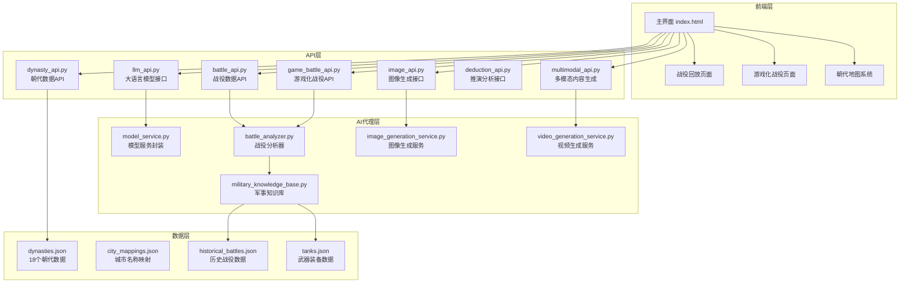

# Mr诸葛军事教育AI助手 - 项目全面分析报告

## 📋 项目概述

**项目名称**: Mr诸葛军事教育AI助手  
**项目版本**: 2.1  
**核心定位**: 基于大语言模型的综合性军事教育平台，集成多模态内容生成能力，旨在提供沉浸式的军事历史学习体验。

---

## 🏗️ 项目架构

### 技术栈概览

| 层级 | 技术选型 | 说明 |
|------|---------|------|
| **后端框架** | FastAPI (Python) | 现代化异步Web框架 |
| **前端技术** | 原生JavaScript + CSS3 | 高德地图 + Cesium.js 3D地球 |
| **AI模型** | 智谱AI GLM-4-Flash, OpenRouter | 主备模型自动切换 |
| **数据存储** | JSON文件 | 轻量级数据存储 |
| **部署** | Docker + Nginx | 容器化部署 |

### 系统架构图



---

## 🎯 核心功能模块

### 1. 中国历史朝代系统 ⭐

**功能描述**: 实现从夏朝到清朝的完整时空融合系统，支持一键切换朝代地图，智能显示历史城市。

**已实现功能**:
- ✅ 18个历史朝代完整数据（从前2070年到1912年）
- ✅ 60个历史城市与现代地名映射
- ✅ 城市类型分类系统（首都👑、陪都🏛️、大都会🏙️、要塞🛡️、港口⚓、战役地点⚔️等）
- ✅ 野狐岭之战等战役地点详细标注
- ✅ 历史地图滤镜和视觉风格
- ✅ 朝代信息面板显示
- ✅ 历史城市搜索功能

**数据结构**:
```json
{
  "dynasties": [
    {
      "id": "xia_2070",
      "name": "夏朝",
      "period": "前2070-前1600",
      "capital": {"name": "阳城", "position": [113.62, 34.75], "modernName": "河南登封"},
      "majorCities": [...],
      "historicalEvents": [...],
      "mapStyle": {"filter": "...", "overlayColor": "..."}
    }
  ]
}
```

**API接口**:
- `GET /api/v1/dynasty/health` - 健康检查
- `GET /api/v1/dynasty/dynasties` - 获取所有朝代
- `GET /api/v1/dynasty/dynasty/{id}` - 获取指定朝代详情
- `GET /api/v1/dynasty/cities/{id}` - 获取朝代城市
- `GET /api/v1/dynasty/search-city/{name}` - 搜索历史城市
- `GET /api/v1/dynasty/historical-events/{id}` - 获取历史事件
- `GET /api/v1/dynasty/categories` - 获取朝代分类
- `GET /api/v1/dynasty/quick-search` - 快速搜索

**支持朝代列表**:
| 分类 | 朝代 |
|------|------|
| 上古三代 | 夏朝、商朝、周朝 |
| 春秋战国 | 春秋时期、战国时期 |
| 秦汉 | 秦朝、汉朝 |
| 魏晋南北朝 | 三国、晋朝 |
| 隋唐 | 隋朝、唐朝 |
| 五代十国 | 五代十国 |
| 宋辽金元 | 北宋、南宋、辽朝、西夏、金朝、元朝 |
| 明清 | 明朝、清朝 |

---

### 2. 战役分析系统

**功能描述**: 提供历史战役的智能分析和可视化展示。

**已实现功能**:
- ✅ 战役数据API接口
- ✅ 赤壁之战示例数据
- ✅ 战役时间线展示
- ✅ 兵力对比分析
- ✅ 地形数据支持

**API接口**:
- `GET /api/v1/battle/{battle_name}` - 获取战役数据

**数据结构**:
```json
{
  "battle_metadata": {...},
  "military_forces": [...],
  "battle_timeline": [...],
  "terrain_data": {...}
}
```

---

### 3. 游戏化战役系统

**功能描述**: 专门为《全面战争》风格的战役可视化提供支持。

**已实现功能**:
- ✅ 战役列表查询
- ✅ 战役详情获取
- ✅ 兵种信息查询
- ✅ 战术分析
- ✅ 队形动画数据
- ✅ 战役特效配置
- ✅ 战役场景模拟

**API接口**:
- `GET /api/v1/game/battles` - 获取所有战役
- `GET /api/v1/game/battle/{battle_id}` - 获取战役详情
- `GET /api/v1/game/units/{period}` - 获取兵种信息
- `POST /api/v1/game/battle/{battle_id}/analyze` - 分析战术
- `GET /api/v1/game/battle/{battle_id}/formation/{formation_name}` - 获取队形动画
- `GET /api/v1/game/battle/{battle_id}/effects` - 获取特效配置
- `POST /api/v1/game/battle/{battle_id}/simulate` - 模拟战役

**支持的队形**:
- 希腊方阵 (phalanx)
- 盾牌墙 (shield_wall)
- 骑兵楔形阵 (cavalry_wedge)
- 线列阵 (linear_formation)
- 齐射 (volley)

---

### 4. AI代理系统

**功能描述**: 集成大语言模型，提供智能分析和内容生成能力。

**已实现功能**:
- ✅ 模型服务抽象层
- ✅ 智谱AI GLM-4-Flash 集成
- ✅ OpenRouter 多模型支持
- ✅ 主备模型自动切换
- ✅ 战役分析器
- ✅ 军事知识库
- ✅ 图像生成服务
- ✅ 视频生成服务

**模型配置**:
```python
# 主模型
ZhipuAI GLM-4-Flash (智谱清影CogVideoX-Flash)

# 备份模型
OpenRouter (支持Claude/GPT/Mistral等)
```

**API接口**:
- `POST /api/v1/llm/chat` - 大语言模型对话
- `POST /api/v1/image/generate` - 图像生成
- `POST /api/v1/multimodal/generate` - 多模态内容生成

---

### 5. 前端交互系统

**功能描述**: 提供沉浸式的用户交互界面。

**已实现功能**:
- ✅ 高德地图集成（平面地图）
- ✅ Cesium.js 3D地球视图
- ✅ 朝代选择器（分组显示）
- ✅ 历史城市标记系统
- ✅ 朝代信息面板
- ✅ 地图样式切换
- ✅ 战役回放页面
- ✅ 游戏化战役回放页面
- ✅ 窗口管理系统
- ✅ 战术绘图系统
- ✅ 音频系统
- ✅ 教育系统

**前端文件结构**:
```
static/
├── index.html                    # 主界面（军事指挥中心）
├── battle-replay.html            # 战役回放页面
├── game-battle-replay.html       # 游戏化战役回放
├── cesium/                       # Cesium地球视图库
├── js/
│   ├── window-manager.js         # 窗口管理系统
│   ├── drawing-system.js         # 战术绘图系统
│   ├── audio-system.js           # 音频系统
│   └── educational-system.js     # 教育系统
└── archive/                      # 历史版本存档
```

---

## 📊 数据架构

### 知识库文件

| 文件 | 说明 |
|------|------|
| `knowledge_base/dynasties.json` | 18个朝代完整数据 |
| `knowledge_base/city_mappings.json` | 城市名称映射关系 |
| `knowledge_base/historical_facts/historical_figures.json` | 历史人物数据 |
| `knowledge_base/military_data/battles.json` | 战役数据库 |
| `knowledge_base/military_data/historical_battles.json` | 历史战役详情 |
| `knowledge_base/weapon_data/tanks.json` | 武器装备数据 |

### 数据统计

- **朝代数量**: 18个
- **历史城市**: 60个
- **战役地点**: 10个（野狐岭之战相关）
- **历史事件**: 每个朝代3个重要事件
- **时间跨度**: 从前2070年到1912年（约4000年）

---

## 🔧 技术实现亮点

### 1. 智能模型切换
```python
class HybridModelService(ModelService):
    """混合模型服务：主备切换"""
    def __init__(self, primary: ModelService, backup: ModelService):
        self.primary = primary
        self.backup = backup
```

### 2. RESTful API设计
- 统一的响应格式
- 完善的错误处理
- 支持模糊搜索
- 高性能并发处理

### 3. 数据驱动架构
- JSON格式存储，易于维护
- 历史与现代地名映射
- 支持复杂的历史事件时间序列

### 4. 模块化设计
- 前后端分离
- API模块独立
- AI代理可插拔

---

## 🚀 部署架构

### Docker容器化
- `Dockerfile` - 主应用容器
- `docker-compose.yml` - 服务编排
- `nginx.conf` - 反向代理配置

### 启动方式
```bash
# 方式1: 直接启动
python src/main.py

# 方式2: Docker部署
docker-compose up -d
```

### 访问地址
- 主界面: http://localhost:8000
- API文档: http://localhost:8000/docs

---

## 📝 项目进展总结

### 已完成功能 ✅

| 模块 | 状态 | 完成度 |
|------|------|--------|
| 朝代数据架构 | ✅ 完成 | 100% |
| 朝代API接口 | ✅ 完成 | 100% |
| 前端朝代选择器 | ✅ 完成 | 100% |
| 历史城市标记系统 | ✅ 完成 | 100% |
| 战役数据API | ✅ 完成 | 100% |
| 游戏化战役API | ✅ 完成 | 100% |
| AI模型集成 | ✅ 完成 | 100% |
| 图像生成服务 | ✅ 完成 | 100% |
| 视频生成服务 | ✅ 完成 | 100% |
| 前端交互界面 | ✅ 完成 | 100% |

### 已修复问题 🔧

- ✅ 高德地图API调用错误修复 (`setCenterAndZoom` → `setCenter` + `setZoom`)
- ✅ 朝代数据扩展（从9个扩展到18个）
- ✅ 战役地点数据添加（野狐岭之战10个地点）

---

## 🎯 后续优化建议

### 短期优化

1. **前端优化**
   - 添加朝代切换动画效果
   - 优化地图加载性能
   - 添加加载进度条

2. **数据扩展**
   - 添加更多历史战役（赤壁之战、淝水之战等）
   - 增加更多城市和历史事件
   - 添加历史人物详细数据

3. **功能增强**
   - 实现历史事件时间轴播放
   - 添加朝代对比功能
   - 支持战役推演交互

### 长期扩展

1. **AI能力增强**
   - 集成更多AI模型
   - 优化分析准确性
   - 添加个性化推荐

2. **平台扩展**
   - 移动端适配
   - 离线模式支持
   - API开放平台

3. **教育功能**
   - 添加学习进度跟踪
   - 实现成就系统
   - 开发测验功能

---

## 💡 项目价值

### 教育价值
- 为军事历史教育提供完整时空背景
- 提升历史学习的趣味性和效果
- 促进中华优秀传统文化的传播

### 技术价值
- 创新性的时空融合技术
- 数据驱动的教育系统设计
- 现代化的Web技术架构

### 社会价值
- 数字化保护和传承历史文化
- 推动历史教育的创新发展
- 增强民族文化自信

---

## 📌 关键文件索引

### 后端核心文件
- [`src/main.py`](src/main.py) - 主应用入口
- [`src/api/dynasty_api.py`](src/api/dynasty_api.py) - 朝代数据API
- [`src/api/battle_api.py`](src/api/battle_api.py) - 战役数据API
- [`src/api/game_battle_api.py`](src/api/game_battle_api.py) - 游戏化战役API
- [`src/ai_agent/model_service.py`](src/ai_agent/model_service.py) - 模型服务

### 数据文件
- [`knowledge_base/dynasties.json`](knowledge_base/dynasties.json) - 朝代数据
- [`knowledge_base/city_mappings.json`](knowledge_base/city_mappings.json) - 城市映射

### 前端文件
- [`static/index.html`](static/index.html) - 主界面

### 配置文件
- [`.env`](.env) - 环境变量配置
- [`requirements.txt`](requirements.txt) - Python依赖

---

## 📚 参考文档

- [项目结构分析报告.md](项目结构分析报告.md)
- [中国历史朝代系统完整实施规划.md](中国历史朝代系统完整实施规划.md)
- [中国历史朝代系统实施完成报告.md](中国历史朝代系统实施完成报告.md)
- [朝代系统扩展完成报告.md](朝代系统扩展完成报告.md)
- [调试修复完成报告.md](调试修复完成报告.md)
- [历史朝代数据架构.md](历史朝代数据架构.md)
